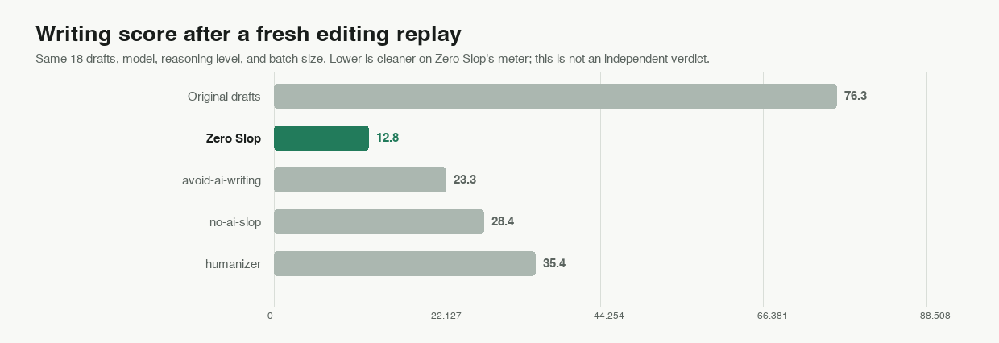

<picture>
  <source media="(prefers-color-scheme: dark)" srcset="assets/logo/zero-slop-logo-reversed.svg">
  
</picture>

# Zero Slop

Find and remove AI slop in your writing. Get rid of workslop without losing your core intent and message.

Zero Slop is a free, open-source set of instructions and checks for an AI assistant. The assistant edits your draft. The local tools flag stock language and compare names, numbers, links, quotations, code, tables, and paths with the original. If your ChatGPT setup does not support skills, [try the browser editor](https://zero-slop.ai/try/) without installing anything.


## Why it exists

An AI draft can be grammatical and still sound like everybody else's. Asking for a rewrite can also change a number or smooth away your point. Zero Slop tells your assistant what to cut, then checks the result against your original. The writing score finds patterns worth reviewing; it cannot tell who wrote the text.

<a href="assets/zero-slop-demo.mp4?v=dark-shell-restored-20260906">
  <picture>
    <source media="(prefers-reduced-motion: reduce)" srcset="assets/zero-slop-demo-poster.png?v=dark-shell-restored-20260906">
    <source type="image/webp" srcset="assets/zero-slop-demo.webp?v=dark-shell-restored-20260906">
    
  </picture>
</a>

## See an edit

Here is a short launch draft:

> We're thrilled to announce that our team has leveraged cutting-edge machine learning to deliver a seamless onboarding experience, reducing setup time by 40%.

The local scorer gives it 99.3/100. Lower is better. It flags “We're thrilled
to,” “leveraged,” “cutting-edge,” and “seamless.”

An edit that keeps the stated result:

> We used machine learning to reduce onboarding setup time by 40%.

```text
Writing score: 9.5/100  [clear]
  Flagged phrases : 0 across 10 words
```

The result still claims a 40% reduction in setup time. See four complete pairs in [`examples/`](examples/).

Use it on launch posts, changelogs, emails, or research summaries. You can score drafts without editing.

## Quick start

To try the browser editor, use a sample you are comfortable sending to a hosted service. Compare its edit with your original before you use it. The slash command below works only in an assistant where you have installed the skill.

If you use Claude Code, Codex, or another assistant that supports skills, install Zero Slop there:

```sh
npx skills add manavmishra/ZeroSlop --global
```

```text
/zero-slop (your writing)
```

To see the flagged passages without an edit, use `/zero-slop inspect (your writing)`.

The command above works with Claude Code and Codex. In Claude.ai, upload the [skill ZIP](https://github.com/manavmishra/ZeroSlop/releases/latest/download/zero-slop.zip). [Other installation paths](DISTRIBUTION.md) include Gemini CLI and remote MCP connections where your client allows them. You can also [score a file locally](#local-scoring) without a model call.

The installed checks run locally, while the assistant that edits your text follows its own privacy settings. The browser editor and [hosted MCP service](mcp/README.md) send drafts to Workers AI. Check your organization's rules before using any of these with sensitive text.

## What it does

The installed skill ships no model. Your AI assistant, whether Claude, GPT, or another compatible model, reads and edits the draft. The skill supplies the workflow and local tools: a 0 to 100 writing score, source-detail checks, and a final comparison with the original.

Use the score to locate passages worth reviewing. Optional private learning records reason-labelled corrections you provide; it does not learn a complete writing style.

## What it catches

The scorer uses 294 weighted patterns and a 96-term lexicon. It checks for:

- binary contrast formulas: “It's not X. It's Y.”
- canned openers: “We're thrilled to…” and “Here's the thing…”
- vague attribution: “experts agree” and “studies show”
- significance inflation: “marks a pivotal moment” and “a testament to”
- promotional wording: “robust,” “seamless,” and “leverage” when used as hype
- repeated sentence shapes, crowded statistics, and overworked formatting

Context matters: a technical use of “robust” need not trigger the same penalty as sales hype. [`references/eval.md`](references/eval.md) describes all 80 checks.

Unedited AI drafts averaged 77 in [`bench/examples.json`](bench/examples.json). Human writing scored 9 to 21 in [`data/corpus/must-not-flag/`](data/corpus/must-not-flag/). Use these to calibrate the scorer; they cannot establish authorship.

## The editing workflow


Eight responsibilities form one workflow. Each stage is a job; several can share a model. Research informed the checks. We chose eight stages as an engineering convention.

| Stage | Job |
|---|---|
| 1. Scorer | Find exact phrases, pacing problems, readability issues, and overworked formatting. |
| 2. Interpreter | Read the claims, audience, structure, and voice before editing. |
| 3. Rewriter | Remove stock language without inventing detail. |
| 4. Fact gate | Check names, numbers, quotations, links, code, tables, paths, and structure locally. |
| 5. Copy desk | Fix grammar, usage, spelling, and consistency. |
| 6. Read-aloud editor | Catch stumbles, repetition, and awkward transitions. |
| 7. Verifier | Compare the edit with the source for meaning, qualifiers, voice, and format. |
| 8. Fresh-eyes finalizer | Apply only safe final polish, then run one last local check. |

The free web editor combines five AI jobs in at most one live model call. This is not independent model review. Any final change receives one final local recheck.

If repair fails, the editor returns the safest edit with a warning and stops there.

### Optional reader review

You can ask the skill where a particular audience might stop reading without requesting an edit. The [reader-review guide](references/reader-review.md) explains the limits: simulated reactions are not evidence of what real readers prefer. This optional mode adds no hosted model calls.

## Evidence and limits

### A saved, same-model editing test

We ran Zero Slop and three open-source instruction sets on our AI Slop test corpus (18 samples), using GPT-5.4, high reasoning, and pinned instructions. Saved outputs are reproducible. The test partly uses Zero Slop's checks.

| Method | Mean writing score ↓ | Passed local gates | Source check passed | Mean length change |
|---|---:|---:|---:|---:|
| Original drafts | 76.3 | 0/18 | — | — |
| **Zero Slop** | **12.8** | **18/18** | **18/18** | -8.9% |
| avoid-ai-writing | 23.3 | 15/18 | 18/18 | -14.6% |
| no-ai-slop | 28.4 | 12/18 | 17/18 | -13.7% |
| humanizer | 35.4 | 9/18 | 17/18 | -7.2% |



Zero Slop's saved rewrites cleared the listed checks. We have not shown that readers prefer them or that the result generalizes. Drafts, hashes, versions, prompts, and limitations are in [`bench/README.md`](bench/README.md).

Zero Slop's outputs came from v2.5.9; newer versions only rescore them. The current scorer matched the prior 84.2% result on a fixed 38-item editorial panel. That is not field accuracy.

<details>
<summary>Other tests and their limits</summary>

- A method-hidden editorial preference replay: [`bench/incumbent-blind-replay/`](bench/incumbent-blind-replay/)
- External-checker clean rates: [`assets/bench-external-checker.png`](assets/bench-external-checker.png)
- Method-hidden quality ranking: [`assets/bench-blind-quality.png`](assets/bench-blind-quality.png)
- Current-model corpus measurements: [`assets/bench-raid-plus.png`](assets/bench-raid-plus.png)
- Antithesis regression set: [`assets/bench-antithesis.png`](assets/bench-antithesis.png)

On 75 labelled antithesis pairs, the reading pass reached 91.2% recall across the full set, 100% recall on shapes in reach, and 100% precision. We constructed and labelled them; this is a regression test, not field accuracy.

Local timings exclude AI editing. On one Apple silicon Mac, the scorer checked 1,000 documents in a median 1.9929 seconds (501.8 per second). Across 12 interleaved runs against 2.7.7, it had 0.26% lower median throughput, within the 5% regression limit. The two-way replay used Zero Slop v2.6.0. [Machine and results](bench/performance-results.json). These timings are not a service-level guarantee.

The [RAID+ audit](bench/raid-plus-corpus/README.md) asks a different question: how often does the scorer flag writing from different models? The pinned sample contains 7,627 usable generations:

| Model | Texts scored | Mean writing score ↓ | At or above 25 |
|---|---:|---:|---:|
| DeepSeek V3 | 1,995 | 14.5 | 10.1% |
| Gemini 3.1 Pro | 1,998 | 17.0 | 18.2% |
| Gemma 3 27B | 1,634 | 21.6 | 30.4% |
| Llama 3.3 70B | 2,000 | 25.5 | 41.7% |

RAID+ records which model wrote each passage, not whether it reads well. The [Beemo paired-edit audit](bench/beemo-corpus/README.md) asks how scores change after human editing: raw responses averaged 30.2, expert edits 25.3, and human answers 20.0. Beemo has no writing-quality labels either.

</details>

### Documented features


The chart compares features documented at pinned commits. It does not measure how well any tool writes. See [`bench/README.md`](bench/README.md) for data and reproduction notes.

The checks draw on research into [predictable machine wording](https://arxiv.org/abs/2301.11305) and [overused vocabulary](https://arxiv.org/abs/2406.07016). Zero Slop cannot identify an author: detectors can [misclassify non-native English](https://arxiv.org/abs/2304.02819).

## Private learning

You decide whether to teach Zero Slop a preference. Give it an original output, your edited version, and the reason for the change. It does not watch your files, browser, or publishing tools. Private data stays under `$ZERO_SLOP_HOME`; it is not committed to this repository or used to retrain a model.

A profile selected by name can exempt existing watchlist words. It does not learn your cadence, tone, or entire writing style.

## For developers

### Hosted MCP

The endpoint for compatible clients is:

```text
https://mcp.zero-slop.ai/mcp
```

[Connection options](mcp/README.md).

For Gemini CLI, run `gemini extensions install https://github.com/manavmishra/ZeroSlop --auto-update`. For file-upload assistants, download the [single-file bundle](https://github.com/manavmishra/ZeroSlop/releases/latest/download/zero-slop-single-file.md).

### Local scoring

Score a file without sending it to a model:

```sh
npx zero-slop score draft.md
```

From a cloned checkout, check a folder against the review threshold of 25:

```sh
python3 scripts/slopscore.py --batch drafts/ --gate 25
```

### Command line

The CLI sends a file to the hosted editor without changing the file on disk:

```sh
npx --yes zero-slop@2.12.5 deslop draft.md --genre professional
```

Use `-` for stdin and `--json` for structured output. `--require-approved` prints the result but exits nonzero when review is needed. Requires Node.js 22+; offline `score` also needs Python 3. [CLI options and privacy](docs/cli.md).

### REST API

The REST API accepts the same edit request:

```sh
curl --fail-with-body --max-time 75 https://mcp.zero-slop.ai/v1/deslop \
  -H 'Content-Type: application/json' \
  --data '{"text":"Maya owns the pricing review.","genre":"professional"}'
```

Check `status` before using an edit. Shared free capacity accepts up to 20,000 Unicode code points after trimming. [API reference](docs/rest-api.md) · [OpenAPI contract](https://mcp.zero-slop.ai/openapi.json)

## Find the source

| Path | Purpose |
|---|---|
| [`SKILL.md`](SKILL.md) | The complete detect, rewrite, verify, and learn workflow |
| [`scripts/slopscore.py`](scripts/slopscore.py) | Offline meter and source-detail gate |
| [`scripts/register.py`](scripts/register.py) | Performed-register and reading pass |
| [`references/`](references/) | Genre guidance, tells, safeguards, and evaluation rules |
| [`examples/`](examples/) | Reproducible before-and-after edits |
| [`bench/`](bench/) | Frozen benchmarks, provenance, and limitations |
| [`mcp/`](mcp/) | Optional hosted MCP server documentation |
| [`DISTRIBUTION.md`](DISTRIBUTION.md) | Direct installs, marketplace submissions, and release synchronization |

## Contribute or get help

Found a false positive, a broken check, or a better example? Use the [issue forms](https://github.com/manavmishra/ZeroSlop/issues/new/choose) or start a [Discussion](https://github.com/manavmishra/ZeroSlop/discussions). If you want to change a pattern, read [`CONTRIBUTING.md`](CONTRIBUTING.md) and include tests with your pull request.

For setup help, see [`SUPPORT.md`](SUPPORT.md). Report security issues through [`SECURITY.md`](SECURITY.md).

## Credits

Zero Slop builds on ideas from [First Reader](https://github.com/Shubhamsaboo/awesome-llm-apps/tree/f56f4febaac4eb869c2e98859e78612889913d3e/agent_skills/first-reader), [no-ai-slop](https://github.com/petergyang/no-ai-slop), [humanizer](https://github.com/blader/humanizer), [de-slop](https://github.com/isatimur/de-slop), [stop-slop](https://github.com/hardikpandya/stop-slop), [unslop-text](https://github.com/JCarterJohnson/vibecoded-design-tells/tree/main/unslop-ai-text), and [avoid-ai-writing](https://github.com/conorbronsdon/avoid-ai-writing).

## License

[MIT](LICENSE)
